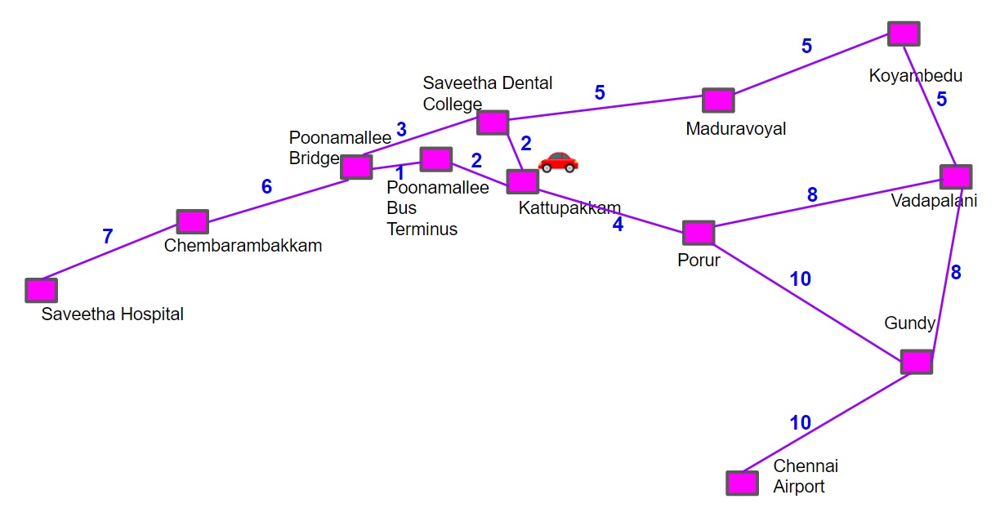

# Dijkstra's Shortest Path Algorithm
## AIM

To develop a code to find the shortest route from the source to the destination point using Dijkstra's shortest path algorithm.

## THEORY
Explain the problem statement

## DESIGN STEPS

### STEP 1:
Identify a location in the google map:

### STEP 2:
Select a specific number of nodes with distance

### STEP -> Write your own steps:

## ROUTE MAP
#### Include your own map
#### Example map

## PROGRAM
Include your code here

## OUTPUT:

Justify that the algorithm always returns the shortest path:

## RESULT:

